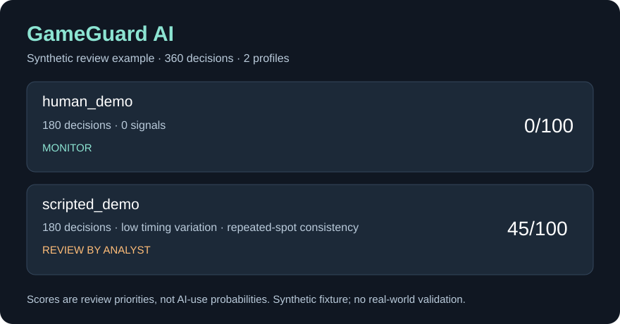

# GameGuard AI — Poker Integrity Review Prototype

**Self-hosted review aid for online poker platforms. Private source available for one-time acquisition.**

GameGuard AI takes decision telemetry and returns review cases with interpretable signals and hand references. Its user is an integrity analyst. It does not automatically penalize players or prove AI/solver use.

## Demonstrated functionality — v0.5

- Token-authenticated analysis API and a local browser review console with filters, per-hand traces and JSON/CSV report export.
- CSV adapter and a conservative parser for a subset of English PokerStars text hand histories. Player and table names are pseudonymized locally with an operator-provided key.
- Five heuristic signal types across timing, repeated operator-defined decision contexts, session duration and shared device pseudonyms. The report says when timing, spot or device signals are unavailable.
- Descriptive action counts by betting street, sample hand references, Dockerfile, deployment and handoff instructions, synthetic fixtures and **29 passing tests**.
- Independent-label evaluation command reports confusion matrix and review burden; real reviewed labels are still needed.
- No seller-run backend, subscription or hosted AI dependency.

## Reproducible synthetic example

| Profile | Decisions / hands | Priority score | Status | Observations |
|---|---:|---:|---|---|
| Varied timing/actions | 180 / 180 | 0/100 | Monitor | No triggered signals |
| Scripted timing/actions | 180 / 180 | 45/100 | Review | Low timing variation and repeated-spot consistency |

**This is seller-authored synthetic data.** The scores are review priorities, not probabilities. The fixtures do not measure fraud detection quality or a real-world false-positive rate. Legitimate behavior and logging artifacts can create alerts.

## Hand-history limitations

Ordinary text hand histories include actions and hand-start time, but do not provide per-decision reaction times. The parser never invents them. A hand-history-only report can show play patterns and hand traces, yet may contain no actionable RTA flag. The importer was checked against 15 older public real PokerStars history fixtures (181 actions), **not a current operator export**; coverage is limited to documented English Hold'em action lines. Operator event telemetry is required for timing and richer context.

All 73 player IDs in the external 15-hand sample have insufficient data, and no misconduct labels exist there. The buyer should validate on consented, labelled cases in shadow mode. This build does not include a solver comparison, blackjack module, persistent case database or production certification. Docker build was not run in the seller's environment; the private source includes a Docker verification script for a Docker host. Direct HTTP startup and authenticated analysis were checked.

## Acquisition

Private source, tests, synthetic demo, Dockerfile and handoff notes are offered for a proposed **€5,000 one-time source acquisition**, subject to buyer diligence and written transfer terms. This is an asking price, not a verified market valuation or a claim of proven detection performance.

Contact [the owner on GitHub](https://github.com/Inkh95) to request a supervised technical demonstration. The private source is not published in this repository.
